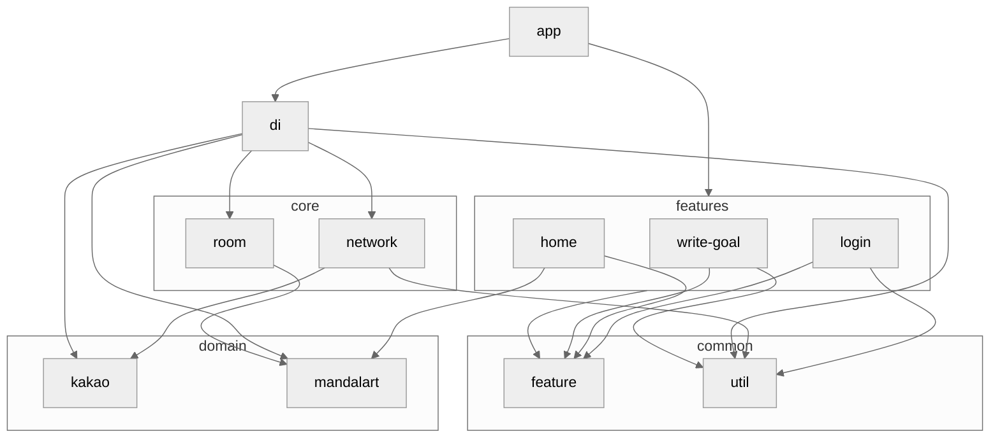

# Eggtart-Android

EggTart Module Dependency Graph

```mermaid
%%{
  init: {
    'theme': 'neutral'
  }
}%%

graph TB

  subgraph common
    feature
    util
  end
  subgraph core
    network
    room
  end
  subgraph domain
    kakao
    mandalart
  end
  subgraph features
    home
    login
    write-goal
  end
  login --> feature
  login --> util
  network --> kakao
  network --> util
  features --> feature
  home --> feature
  home --> mandalart
  app --> features
  app --> di
  di --> util
  di --> room
  di --> network
  di --> mandalart
  di --> kakao
  room --> mandalart
  write-goal --> feature
  write-goal --> util
```